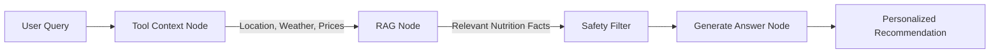

Here’s a fancy, well-structured `README.md` for your **AgenticNutrition** project — designed to be visually appealing, informative, and developer-friendly.

```markdown
# 🥗 AgenticNutrition

> *An intelligent, multi-agent nutrition assistant powered by LLMs, RAG, and real-time context-aware tools.*


---

## 🌟 Overview

**AgenticNutrition** is not just another diet app. It’s an **agentic reasoning system** that combines:

- 🧠 **LLM orchestration** via LangGraph  
- 🔍 **RAG** from structured & unstructured nutrition data  
- 🌦️ **Real-time context** (location, weather, seasonal food, local prices)  
- 🛡️ **Safety & moderation** layers  
- 📊 **EHR-aware personalization** (demo-ready with synthetic data)

Whether you're a developer exploring agentic workflows or a health-tech enthusiast, this project shows how **autonomous agents** can deliver personalized, safe, and actionable nutritional advice.

---

## 🏗️ Project Structure

```bash
AgenticNutrition/
├── .venv/                         # Virtual environment
├── app/
│   └── frontend.py                # Streamlit UI
├── agent/
│   ├── graph_builder.py           # LangGraph workflow            ✅
│   ├── llm.py                     # LLM client (OpenAI/Groq/etc.) ✅ 
│   ├── state.py                   # Agent state schema            ✅
│   ├── nodes/                     # Graph nodes
│   │   ├── tool_context_node.py   # Tool fetching (weather, prices, location)  ✅
│   │   ├── rag_node.py            # Retrieve relevant nutrition info
│   │   └── generate_answer_node.py # Final answer generation
│   ├── prompts/                   # Prompt templates
│   │   └── prompt.py
│   ├── rag/                       # RAG pipeline
│   │   ├── rag.py
│   │   ├── retriever.py
│   │   └── vectorstore.py
│   ├── safety/                    # Input/output safety
│   │   └── safety.py
│   └── tools/                     # Custom tools
│       ├── user_location.py
│       ├── weather_and_season.py
│       └── local_food_prices.py
├── data/                          # Data sources
│   ├── nutrition.csv
│   ├── food_prices.csv
│   └── ehr_sample.json
├── utils/
│   └── helpers.py
├── .env
├── llm_manager.py                 # Multi-provider LLM abstraction ✅
├── main.py                        # Entry point
├── requirements.txt
└── README.md
```

---

## 🚀 Getting Started

### 1. Clone the repository

```bash
git clone https://github.com/jehanhasanbd/AgenticNutrition.git
cd AgenticNutrition
```

### 2. Set up virtual environment

```bash
python -m venv .venv
source .venv/bin/activate   # On Windows: .venv\Scripts\activate
```

### 3. Install dependencies

```bash
pip install -r requirements.txt
```

### 4. Environment variables

Create a `.env` file:

```env
OPENAI_API_KEY=your_key_here
# or
GROQ_API_KEY=your_key_here

WEATHER_API_KEY=your_weather_api_key
MAPS_API_KEY=your_maps_api_key
```

### 5. Run the app

```bash
streamlit run app/frontend.py
```

Or use the CLI entry point:

```bash
python main.py
```

---

## 🧠 How It Works (Agentic Flow)



- **Tool Context Node** → Fetches dynamic context (location, weather, seasonal food, local prices).  
- **RAG Node** → Retrieves relevant nutritional data from `nutrition.csv` and `ehr_sample.json`.  
- **Safety Node** → Blocks harmful or dangerous suggestions.  
- **Generate Node** → LLM synthesizes final advice.

---

## 🧪 Example Use Cases

| Query | Agent Action |
|-------|---------------|
| *"What should I eat today in Austin?"* | Fetches local weather, season, and nearby affordable produce → suggests a seasonal, cost-effective meal. |
| *"I have high blood pressure. Any lunch ideas?"* | Checks EHR sample + RAG on low-sodium foods → generates a tailored recipe. |
| *"Is kale good for me?"* | RAG retrieves nutritional profile + safety check → gives evidence-based answer. |

---

## 🛠️ Customization

### Add a new tool

1. Create a new file under `agent/tools/`  
2. Implement the tool function  
3. Register it in `tool_context_node.py`

### Swap LLM provider

Edit `llm_manager.py` — supports:

- OpenAI  
- Groq  
- Anthropic  
- Local models via Ollama

### Update data sources

Place new `.csv` or `.json` files in `/data` and update the RAG retriever logic.

---

## 📦 Dependencies

Key packages:

- `streamlit` – UI  
- `langgraph` – Agent orchestration  
- `langchain` – RAG & tools  
- `chromadb` / `faiss` – Vector store  
- `openai` / `groq` – LLM backends  
- `pandas` – Data handling  
- `pydantic` – State management

Full list in `requirements.txt`.

---

## 🤝 Contributing

Contributions are welcome!  
Please open an issue or PR for:

- New tools (e.g., recipe APIs, allergy checkers)  
- Better safety filters  
- Multi-user session memory  
- LLM evaluation metrics  

---

## 📄 License

MIT — use freely, but please attribute.

---

## 🌱 Roadmap

- [ ] Persistent memory (via SQLite / Redis)  
- [ ] Meal plan calendar  
- [ ] Grocery list generator  
- [ ] Multi-agent debate (different nutritional philosophies)  
- [ ] Mobile-friendly UI

---

## 🙏 Acknowledgments

Built with inspiration from real-world nutrition challenges and the growing field of **agentic AI**.  
Thanks to the LangChain & Streamlit communities.

---

## 📬 Contact

Project Lead: [Your Name]  
GitHub: [@yourusername](https://github.com/yourusername)  
Issues & Discussion: [GitHub Issues](https://github.com/yourusername/AgenticNutrition/issues)

---

*Eat smart, live better — with AgenticNutrition.* 🍎
```

---

Let me know if you want a **dark-mode version**, a **short "cheatsheet" style README**, or a version tailored for **Hugging Face Spaces** or **Docker deployment**.